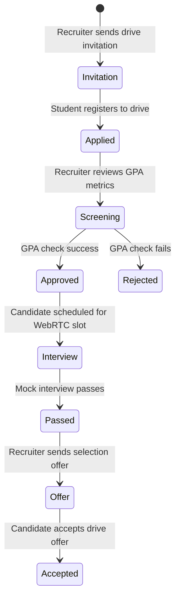
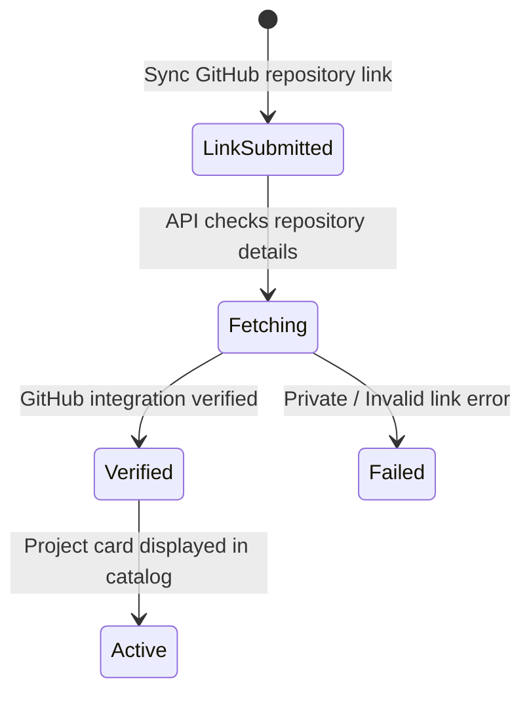

# Engineers Platform — Information Architecture Wireframes (IAW)

**Document Classification:** Product Structural Blueprints & UX Specifications  
**Status:** Official Wireframes Constitution [ONLY Source of Truth]  
**Version:** 1.0  
**Authors:** Principal Product Architect, Principal UX Architect, Staff Product Designer, Information Architect  

---

## SECTION 1 — CORE LANDING & PUBLIC WORKSPACES

Structural specifications and ASCII layouts for public gateway entries.

### 1.1 Authentication Portal (`/auth`)

#### 1.1.1 Structural Overview
* **Purpose:** Initial gateway page facilitating credential entries and registration workflows.
* **Business Goal:** Minimize drop-offs on registration funnels.
* **Primary Users:** Guest Users (Unauthenticated).
* **Secondary Users:** None.
* **Success Metrics:** Registration completion rate, signup speed.

#### 1.1.2 Viewport Wireframes Layouts

##### Desktop Viewport (1280px+)
```
+------------------------------------------------------------+
| LOGO HEADER                                                |
+------------------------------------------------------------+
|                                                            |
|                 +------------------------+                 |
|                 | LOGIN FORM PANELS      |                 |
|                 | - Email Input Field    |                 |
|                 | - Password Input Field |                 |
|                 |                        |                 |
|                 | [ SIGN IN CTA BUTTON ] |                 |
|                 |                        |                 |
|                 | [ GITHUB OAUTH LINK ]  |                 |
|                 +------------------------+                 |
|                                                            |
+------------------------------------------------------------+
```

##### Tablet Viewport (768px - 1024px)
```
+------------------------------------------------------------+
| LOGO HEADER                                                |
+------------------------------------------------------------+
|                                                            |
|              +------------------------------+              |
|              | LOGIN FORM PANELS            |              |
|              | - Email Input Field          |              |
|              | - Password Input Field       |              |
|              |                              |              |
|              | [ SIGN IN CTA BUTTON ]       |              |
|              +------------------------------+              |
|                                                            |
+------------------------------------------------------------+
```

##### Mobile Viewport (<768px)
```
+------------------------------------+
| LOGO HEADER                        |
+------------------------------------+
| Email Input Field                  |
| Password Input Field               |
|                                    |
| [ SIGN IN CTA BUTTON ]             |
|                                    |
| [ GITHUB OAUTH LINK ]              |
+------------------------------------+
```

#### 1.1.3 Information Hierarchy
* **Primary Focus:** Credentials form inputs.
* **Secondary Focus:** GitHub OAuth SSO button.
* **Supporting Content:** Registration role selector toggle (Student / Recruiter / TPO).
* **CTAs:** Primary: "Sign In" | Secondary: "Create Account".
* **Warnings:** Invalid login credential alert boxes.

#### 1.1.4 Visual Reading Order & Interaction Map
* **Reading Order:** Center Z-Pattern (Logo ➔ Credentials ➔ CTA ➔ SSO).
* **Interaction Map:**
  - *Click / Tap:* Submit credentials, toggle registration panel.
  - *Keyboard:* Tab maps focus down inputs; Enter triggers login dispatch.
* **Spacing:** Margins: 24px, Container: Max 480px, Densities: Compact.

#### 1.1.5 Layout & Loading Behaviors
* **Loading:** Disables submit buttons; displays loading status bar inside buttons bounds.
* **Error:** Inline warning message box below input bounds.
* **Permissions:** Gated to Unauthenticated guests.

---

### 1.2 Home/Social Feed (`/feed`)

#### 1.2.1 Structural Overview
* **Purpose:** Dynamic central stream displaying developer updates, repository links, and comments.
* **Business Goal:** Retain active daily user interaction metrics.
* **Primary Users:** Student / Professional.
* **Secondary Users:** Recruiter.
* **Success Metrics:** Weekly active posts count, likes count.

#### 1.2.2 Viewport Wireframes Layouts

##### Desktop Viewport (1280px+)
```
+------------------------------------------------------------+
| HEADER (Logo - Global Search Box - Profile Dropdown)       |
+------------------------------------------------------------+
| LEFT NAV PANEL    | CENTER FEED STREAM    | RIGHT PANEL    |
| - Profile Card    | - Post Composer box   | - Trends List  |
| - Navigation List | - Stream cards stream | - Verification |
+-------------------+-----------------------+----------------+
```

##### Tablet Viewport (768px - 1024px)
```
+------------------------------------------------------------+
| HEADER (Logo - Search Box - Profile Dropdown)              |
+------------------------------------------------------------+
| CENTER FEED STREAM                        | RIGHT PANEL    |
| - Post Composer box                       | - Trends List  |
| - Feed cards list                         |                |
+-------------------------------------------+----------------+
```

##### Mobile Viewport (<768px)
```
+------------------------------------+
| HEADER (Logo - Search Icon)        |
+------------------------------------+
| Post Composer Input                |
| Feed cards list                    |
|                                    |
+------------------------------------+
| STICKY BOTTOM NAVIGATION BAR       |
+------------------------------------+
```

#### 1.2.3 Information Hierarchy
* **Primary Focus:** Timeline Feed Card content (Author, Markdown text, synced repositories).
* **Secondary Focus:** Navigation list links.
* **Supporting Content:** Trending topics checklist.
* **CTAs:** Primary: "Share Post" | Secondary: "Like/Comment".
* **Warnings:** Deleted post notification banner.

#### 1.2.4 Visual Reading Order & Interaction Map
* **Reading Order:** Standard F-Pattern (Header search ➔ Left nav ➔ Center post composer ➔ Feed stream).
* **Interaction Map:**
  - *Click / Tap:* Like post, launch Comment drawer, link to user profile.
  - *Hover:* Translate cards vertically by -4px (`hover-lift`).
  - *Scroll:* Infinite scroll down feed stream; header remains fixed sticky.
* **Spacing:** Grid: 12 Columns, Margins: 16px, Container: 1200px.

#### 1.2.5 Layout & Loading Behaviors
* **Loading:** Skeleton block overlays mimic profile headers and text boxes.
* **Empty:** Shows Lucide illustration: *"No posts in feed. Follow profiles to begin."*
* **Permissions:** Gated to Authenticated users for write actions. Read actions public.

---

## SECTION 2 — CORE PLACEMENTS & RECRUITMENT WORKSPACES

Detailed blueprints mapping primary operational recruitment consoles.

### 2.1 Student Placements Dashboard (`/placements`)

#### 2.1.1 Structural Overview
* **Purpose:** Monitoring campus placements drive applications and pending interview slots.
* **Business Goal:** Secure high placement drive registrations.
* **Primary Users:** Student (`STUDENT` role).
* **Secondary Users:** None.
* **Success Metrics:** Shortlist conversion rates, slot confirmation rates.

#### 2.1.2 Viewport Wireframes Layouts

##### Desktop Viewport (1280px+)
```
+------------------------------------------------------------+
| HEADER (Logo - Global Search - Profile Dropdown)           |
+------------------------------------------------------------+
| LEFT PANEL (Drive Invites) | CENTER CANVAS (Applications)  |
| - Drive Invites cards list | - Steps-timeline kanban board |
|                            | - Interview Schedules list    |
+----------------------------+-------------------------------+
```

##### Tablet Viewport (768px - 1024px)
```
+------------------------------------------------------------+
| HEADER                                                     |
+------------------------------------------------------------+
| CENTER CANVAS (Applications & Interviews lists)            |
| - Drive Invites collapsable accordion triggers             |
+------------------------------------------------------------+
```

##### Mobile Viewport (<768px)
```
+------------------------------------+
| HEADER                             |
+------------------------------------+
| Kanban timeline stages list        |
| Drive Invites checklist sheet      |
| Interviews schedules               |
+------------------------------------+
| STICKY BOTTOM NAVIGATION BAR       |
+------------------------------------+
```

#### 2.1.3 Hierarchy & Widgets Priority
* **Information Priority:** Active timeline progress ➔ Invitations list ➔ Mock schedules.
* **Widget Order:**
  1. `PlacementsMetricsCard` (Top Overview metrics).
  2. `ApplicationKanbanBoard` (Funnel steps checklist).
  3. `DriveInvitesRoster` (Action list to register).
* **CTAs:** Primary: "Register Drive" | Secondary: "Confirm Interview Slot".
* **Widget priority:** MetricsCard: High, KanbanBoard: Critical, InvitesRoster: Critical.

#### 2.1.4 Visual Reading Order & Interaction Map
* **Reading Order:** Standard Z-pattern (Top metrics summary ➔ Left invities details ➔ Right board).
* **Interaction Map:**
  - *Click / Tap:* Confirm Slot selection, open registration dialog.
  - *Drag:* Horizontal scrolling timeline stages lists on mobile viewports.
* **Spacing:** Containers: Max 1280px, Margins: 24px, Column padding: 12px.

#### 2.1.5 Layout & Loading Behaviors
* **Loading:** Skeleton block shimmers matching columns heights.
* **Empty:** Shows Lucide illustration: *"No campus placement drives scheduled. Keep profiles updated."*
* **Permissions:** Restricted to authenticated Student roles.

---

### 2.2 Recruiter Console (`/recruiter`)

#### 2.2.1 Structural Overview
* **Purpose:** Monitor recruitment drives applications logs and candidates profiles directories.
* **Business Goal:** Reduce recruiter screening durations.
* **Primary Users:** Recruiter (`RECRUITER` role).
* **Success Metrics:** Screening completion rates, candidates invites accepted.

#### 2.2.2 Viewport Wireframes Layouts

##### Desktop Viewport (1280px+)
```
+------------------------------------------------------------+
| HEADER (Logo - Search Bar - Profile Dropdown)              |
+------------------------------------------------------------+
| LEFT PANEL (Filters) | CENTER GRID (Candidates List Table) |
| - Batch filters      | - Pipeline funnel summary cards     |
| - GPA sliders        | - Candidates directories table      |
+----------------------+-------------------------------------+
```

##### Tablet Viewport (768px - 1024px)
```
+------------------------------------------------------------+
| HEADER                                                     |
+------------------------------------------------------------+
| Center funnel metrics summary cards                        |
| Candidates directories table (Horizontal scroll)            |
+------------------------------------------------------------+
```

##### Mobile Viewport (<768px)
```
+------------------------------------+
| HEADER                             |
+------------------------------------+
| Sourcing Search Input              |
| Candidates list stack cards        |
| [ Floating Filters Trigger ]       |
+------------------------------------+
```

#### 2.2.3 Hierarchy & Widgets Priority
* **Information Priority:** Funnel metrics summary ➔ Sourcing table roster ➔ Search filters.
* **Widget Order:**
  1. `PipelineFunnelCard` (Applicant count totals).
  2. `ResdexSearchWidget` (Sourcing input).
  3. `Candidates RosterTable` (Applicants records details).
* **CTAs:** Primary: "Post New Job" | Secondary: "Invite College Batch".
* **Widget priority:** FunnelCard: High, SearchWidget: Critical, CandidatesTable: Critical.

#### 2.2.4 Visual Reading Order & Interaction Map
* **Reading Order:** Z-Pattern (Top funnel summaries ➔ Left search sliders ➔ Center roster table).
* **Interaction Map:**
  - *Click / Tap:* Toggle filter checkboxes, click candidate row.
  - *Drag:* GPA slider handle adjustments.
* **Spacing:** Margins: 16px, Column padding: 8px.

---

### 2.3 College TPO Console (`/tpo-dashboard`)

#### 2.3.1 Structural Overview
* **Purpose:** Campus drives coordinates, verification audits queue management.
* **Business Goal:** Maximize batch registrations percentages.
* **Primary Users:** College TPO / TPO Admin.
* **Success Metrics:** Placed student percentages, verify speed.

#### 2.3.2 Viewport Wireframes Layouts

##### Desktop Viewport (1280px+)
```
+------------------------------------------------------------+
| HEADER                                                     |
+------------------------------------------------------------+
| LEFT PANEL (Roster) | CENTER CANVAS (Verifications)        |
| - Drives log list   | - Metrics charts overview panel      |
|                     | - Students verification queue roster |
+---------------------+--------------------------------------+
```

##### Tablet Viewport (768px - 1024px)
```
+------------------------------------------------------------+
| HEADER                                                     |
+------------------------------------------------------------+
| Center metrics overview panel                              |
| Students verifications queue table                         |
+------------------------------------------------------------+
```

##### Mobile Viewport (<768px)
```
+------------------------------------+
| HEADER                             |
+------------------------------------+
| Placed ratio metrics card          |
| Students verifications scroll list |
| Pending drive invite cards         |
+------------------------------------+
```

#### 2.3.3 Hierarchy & Widgets Priority
* **Information Priority:** Verify queue list ➔ Metrics summary ➔ Drives history table.
* **Widget Order:**
  1. `TpoMetricsWidget` (Placed ratio display).
  2. `VerificationQueueCard` (Pending profile checklists).
  3. `CampusDrivesTable` (Drives history status).
* **CTAs:** Primary: "Verify Profile" | Secondary: "Create Drive".
* **Widget priority:** MetricsWidget: High, VerificationQueueCard: Critical, DrivesTable: High.

---

## SECTION 3 — OVERLAYS & STATE TRANSITIONS

Blueprints mapping modally overlayed layouts and transactional state lifecycles.

### 3.1 Overlay Dialog Layout

#### 3.1.1 Structural Overview
* **Purpose:** Modular context dialogues preventing workflow navigation breaks.
* **Primary Users:** Authenticated Users.
* **Success Metrics:** Modal submission rates, modal cancel rates.

#### 3.1.2 Dialog ASCII Wireframe Blueprint
```
+------------------------------------------------------------+
| MAIN WINDOW (Faded / Blurred Background backdrop)           |
|                                                            |
|         +----------------------------------------+         |
|         | MODAL BOX PANEL                        |         |
|         | - Title Header Label    [ CLOSE KEY ]  |         |
|         | - Description / Fields Form area       |         |
|         |                                        |         |
|         | [ SECONDARY CANCEL ]  [ PRIMARY SUBMIT]|         |
|         +----------------------------------------+         |
|                                                            |
+------------------------------------------------------------+
```

#### 3.1.3 Active Overlays Directory
1. **JobPostModal:** Recruiter Workspace. Standard Form validation: fields check length (>10). Dismiss via backdrop click or ESC key.
2. **CreateDriveModal:** TPO Workspace. Coordinates drive parameters. GPAs thresholds validation checks.
3. **ConfirmDialog:** Destruction confirmation box. Confirms actions before API dispatch.

---

### 3.2 System State Lifecycle Machines

#### 3.2.1 Placement Drive Applications Lifecycle


#### 3.2.2 Projects Synchronization Lifecycle


---

## SECTION 4 — GLOBAL APPENDICES (IA STANDARDS)

### APPENDIX A — GLOBAL LAYOUT RULES
All platform pages align to a central grid structure (Desktop: 12-columns, Laptop: 12-columns, Tablet: stacked rows layout, Mobile: 1-column stack). Header remains permanently fixed at top (sticky layout).

### APPENDIX B — DASHBOARD LAYOUT RULES
Console dashboards (Placements, Recruiter, TPO) use a split layout with sidebar panels (left) and dynamic outlet grids (center/right). Width defaults to `max-w-7xl` with 24px margins.

### APPENDIX C — CARD PLACEMENT RULES
Feed and detail listings display as rounded panels. Highlight interactions trigger a `-4px` vertical transform (`hover-lift`) with drop-shadow shifts.

### APPENDIX D — SIDEBAR RULES
Sidebar navigations collapse to secondary drawer panels below `1024px` viewport width limits.

### APPENDIX E — HEADER RULES
Sticky header anchors profile details, notification count badges, global search box, and logo redirects.

### APPENDIX F — MOBILE NAVIGATION RULES
Sticky footer tab bar handles core mobile transitions: Feed, Discover, Jobs, Chats, Profile.

### APPENDIX G — WIDGET PRIORITY MATRIX
* **Critical:** Application Timeline Kanban boards, Credentials forms, Resdex search inputs.
* **High:** Placement metrics cards, verification queue tables, jobs listing sheets.
* **Medium:** Chat rooms listings, project catalog grids.
* **Low:** Trending tags check-lists.

### APPENDIX H — CONTENT HIERARCHY RULES
Core actions (CTA) stack first. Informational properties render center panels. Auxiliary widgets render in sidebar containers.

### APPENDIX I — SPACING RULES
Standard spacing defaults to Multiples of 8px (margins: 16px/24px, container padding: 12px/16px).

### APPENDIX J — RESPONSIVE RULES
- **Desktop (1280px+):** Full layouts, multi-columns.
- **Tablet (768px-1024px):** Columns stack vertically. Sidebars collapse to toggle drawers.
- **Mobile (<768px):** Standalone fullscreen views, bottom sticky bar navigation.

### APPENDIX K — ACCESSIBILITY RULES
Keyboard tab keys follow native sequential DOM indices. Active modal dialogs capture and trap focus until dismissed.

### APPENDIX L — ANIMATION RULES
Overlays slide-in from screen boundaries over `200ms`. Card hover states translate with custom spring curves over `150ms`.

### APPENDIX M — FUTURE RESERVED AREAS
- `div#student-ai-recs` container beneath placements interviews, placeholder for AI preparation reviews.
- `button#tpo-analytics-export` placeholder for campus placements metrics file downloads.

### APPENDIX N — IA CROSS REFERENCES
- **Design System:** Outlines variables configurations.
- **Navigation Specification:** Outlines dynamic router mapping tree.
- **UI Screen Bible:** Details core widgets data contract validations.
