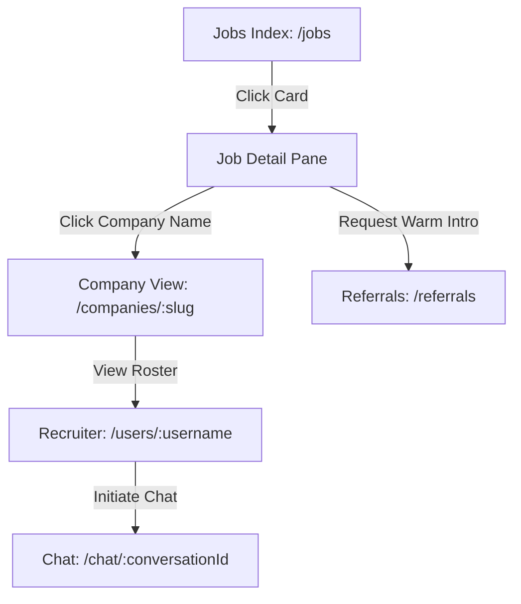
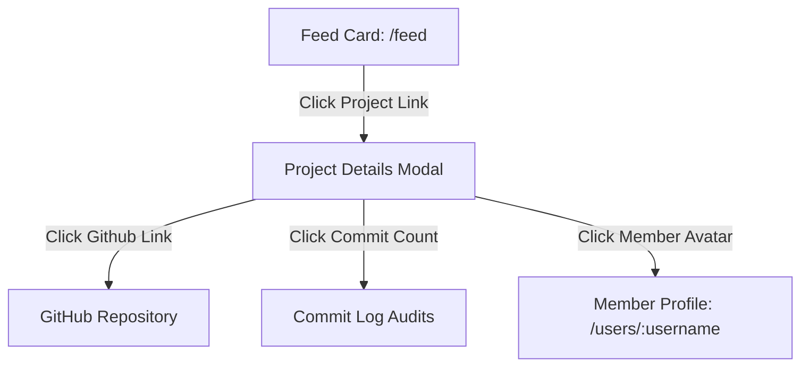
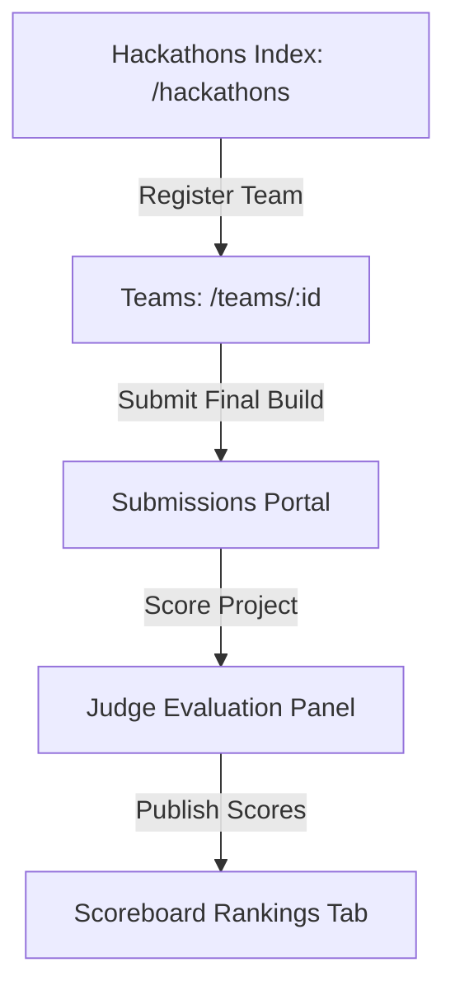

# Engineers Platform — Navigation and Routing Specification (NRS)

**Document Classification:** Information Architecture & Navigation Constitution  
**Status:** Official Navigation Constitute [ONLY Source of Truth]  
**Version:** 1.0  
**Authors:** Principal Information Architect, Principal UX Architect, Staff Product Designer, Navigation Systems Specialist  

---

## SECTION 1 — NAVIGATION PHILOSOPHY

The Engineers Platform navigation ecosystem is built on a single directive: **minimize cognitive friction and guarantee direct structural discoverability**. Because the platform coordinates high-stakes activities (like campus recruitment drives, credential auditing, and job sourcing), navigation is structured as a clear, predictable network of dedicated workspaces.

```
Navigation Architecture Principles:
[Context Gated] ➔ Only present tools relevant to current task role.
[Zero-Jump Path] ➔ Primary destinations must be reached within 2 clicks.
[Explicit Exits] ➔ Workspaces must provide explicit back-navigation vectors.
```

### 1.1 Navigation Principles
1. **Predictable Consistency:** Sidebars, sticky topbars, and bottom tab lists never shift positions dynamically. Dynamic routing modifies viewport content, not global navigation layout shells.
2. **Role Isolation:** Users navigate within workspace boundaries designed for their primary active role. Recruiters interact with candidates pipelines, TPOs with university metrics, and students with drive calendars.
3. **Speed over Decoration:** Visual transitions are fast (`0.2s` page-enter fades). The command system and keyboard hotkeys are prioritized to accelerate navigation.

### 1.2 Information Hierarchy & Cognitive Load Rules
- **Progressive Disclosure:** Complex data grids (e.g., scoring rubrics, recruiter checklists, domain logs) remain hidden inside drawers or nested tab layouts until clicked.
- **Top Nav Gating:** Global header pins only six vital pathways (`Home`, `Discover`, `Network`, `Referrals`, `Chats`, `Jobs`). Low-frequency utilities (Teams, Reputation, Colleges) are housed inside the "More" menu dropdown list.
- **Mobile Thumb Zone:** All critical links map to the bottom tab bar on viewports below `1024px` to minimize thumb-stretch strain.

### 1.3 Search & Universal Bridges
- Search serves as the ultimate shortcut. Typing in the global input field instantly navigates the user to a filtered search results center (`/search`), dynamically listing matches categorized by Users, Projects, Jobs, and Companies.

---

## SECTION 2 — GLOBAL PRODUCT MAP

Hierarchical tree representing all implemented routes, workspaces, and dashboards:

```
Platform Root
├─ Public / Guests Routes
│  ├─ Authentication Page (/auth)
│  ├─ Colleges Catalog Directory (/colleges)
│  │  └─ College Profile Detail View (/colleges/:collegeSlug)
│  │     └─ Public Graduation Batch Directory (/colleges/:collegeSlug/batch/:graduationYear)
│  ├─ Companies Profile Showroom (/companies)
│  │  └─ Company Profile Detail View (/companies/:companySlug)
│  ├─ Public Feed Page (/feed)
│  ├─ Public Discover/Recommendations page (/discover)
│  ├─ Public Projects Viewport (/projects)
│  │  └─ Project Details view (/projects/:projectSlug)
│  ├─ Public Hackathons Hub (/hackathons)
│  │  └─ Hackathon Details viewport (/hackathons/:hackathonSlug)
│  └─ Search Results Hub (/search)
├─ Authenticated Users Workspace (RequireAuth)
│  ├─ Private Profile Dashboard (/profile)
│  ├─ External User profile detail (/users/:username)
│  ├─ Professional Referrals Center (/referrals)
│  ├─ Mock Interview Prep / WebRTC hub (/interviews)
│  ├─ Messaging Chat Rooms (/chat & /chat/:conversationId)
│  ├─ Team Workspace Manager (/teams & /teams/:teamId)
│  ├─ Communities Hub (/communities & /communities/:communitySlug)
│  ├─ Reputation & Badge Catalog (/reputation)
│  ├─ Business Onboarding Portal (/business)
│  └─ Event RSVP Registry (/events)
├─ Role Restricted Workspaces
│  ├─ Student Placements Console (/placements) [STUDENT Gated]
│  ├─ Recruiter Sourcing Console (/recruiter) [RECRUITER Gated]
│  │  └─ Live Campus Drive Shortlisting (/recruiter/drive/:driveId) [RECRUITER Gated]
│  ├─ College TPO Dashboard (/tpo-dashboard) [TPO / COLLEGE_ADMIN Gated]
│  ├─ Company Admin Panel (/companies/:companySlug/admin) [COMPANY_ADMIN Gated]
│  └─ Platform Super Admin Panel (/admin) [SUPER_ADMIN / PLATFORM_ADMIN Gated]
└─ Non-Implemented Roles Workspaces
   ├─ Moderator Workspace (Not Implemented - handled via local posts settings)
   ├─ Judge Workspace (Not Implemented - handled via local hackathon eval panels)
   └─ Organizer Workspace (Not Implemented - handled via inline event editors)
```

---

## SECTION 3 — WORKSPACE ARCHITECTURE

Every active workspace provides a dedicated control panel for a specific user role.

### 3.1 Student Workspace (`/placements`)
* **Purpose:** Allows students to track application phases and schedule upcoming interviews.
* **Entry Point:** Header Profile Dropdown ➔ Click "Placements Dashboard".
* **Exit Point:** Header Link "Home" (`/feed`) or Profile dropdown ➔ Click "View Profile".
* **Primary Navigation:** Core application timeline trackers, invitation checklists.
* **Secondary Navigation:** Tab menus (Active Applications, Drive Invites, Interview slots).
* **Quick Actions:** Accept drive invite, confirm interview schedule.
* **Daily Workflow:** Check pipeline notifications ➔ Review coding round dates ➔ Access mock interview room `/interviews`.

### 3.2 Recruiter Workspace (`/recruiter`)
* **Purpose:** Handles job applications pipeline coordination and Resdex database searches.
* **Entry Point:** Header nav link "Recruiting" or Profile dropdown ➔ click "Recruiter Console".
* **Exit Point:** Global logo click or Profile dropdown ➔ click "View Profile".
* **Primary Navigation:** Recruiting sidebar tabs (Overview, Resdex Search, Jobs Posted, Live Drives).
* **Secondary Navigation:** Candidate Kanban status boards inside job detail sheets.
* **Quick Actions:** Create job opening, invite college batch to drive, move candidate pipeline stage.
* **Daily Workflow:** Review Resdex search matching scores ➔ Advance shortlisted candidates in `/recruiter/drive/:id`.

### 3.3 College Workspace (`/tpo-dashboard`)
* **Purpose:** Coordination center for campus drives, student verifications, and CDCR permissions.
* **Entry Point:** Profile dropdown ➔ Click "TPO Console".
* **Exit Point:** Top header links ➔ Home feed `/feed`.
* **Primary Navigation:** Hero metric cards (Placement rates), Drives checklist tables, CDCR roster.
* **Secondary Navigation:** Pending alumni requests log tables.
* **Quick Actions:** Verify student record, launch campus placement drive, authorize student coordinator.
* **Daily Workflow:** Audit pending verifications list ➔ Approve company invite requests ➔ Coordinate with CDCR logs.

### 3.4 Company Workspace (`/companies/:companySlug/admin`)
* **Purpose:** Roster administration, offices management, and company page settings.
* **Entry Point:** Profile dropdown ➔ Click "Company Console".
* **Exit Point:** Global home feed link.
* **Primary Navigation:** Roster verification logs, office locations configs, brand setup.
* **Quick Actions:** Approve recruiter domain match request, update office address details.
* **Daily Workflow:** Verify employee registration claims ➔ Sync corporate profile data.

### 3.5 Admin Workspace (`/admin`)
* **Purpose:** Platform-wide compliance approvals and moderation checks.
* **Entry Point:** Profile dropdown ➔ Click "Super Admin Console".
* **Exit Point:** Click navigation links in header.
* **Primary Navigation:** Onboarding approval logs, reported post queues, telemetry metrics.
* **Quick Actions:** Approve college onboarding claim, verify new company profile, delete flagged post.
* **Daily Workflow:** Resolve pending college onboarding requests queue ➔ Clean report ticket queues.

### 3.6 Non-Implemented Workspaces
* **Moderator Workspace:** **Not Implemented**. Handled via local community page settings panel; no dedicated moderator dashboard workspace route exists.
* **Judge Workspace:** **Not Implemented**. Evaluation forms are rendered inline inside hackathon submission modals. No separate `/judge` dashboard.
* **Organizer Workspace:** **Not Implemented**. Event generation forms are embedded inline in local screens. No standalone organizer console route.

---

## SECTION 4 — ROLE-BASED NAVIGATION

The UI layout shell dynamically filters navigation actions and routes access based on role attributes.

### 4.1 Visible & Hidden Sidebar/Menu Controls

| User Role | Pinned Header Links | Dropdown Dashboard Targets | Hidden/Blocked Elements |
| :--- | :--- | :--- | :--- |
| **Student** | Feed, Discover, Network, Referrals, Chats, Jobs | `/placements` | Blocked: `/recruiter`, `/tpo-dashboard`, `/admin` |
| **Recruiter**| Feed, Discover, Jobs, Network, Chats, Recruiting | `/recruiter` | Blocked: `/placements`, `/tpo-dashboard`, `/admin` |
| **TPO** | Feed, Discover, Network, Colleges, Chats | `/tpo-dashboard` | Blocked: `/recruiter`, `/placements`, `/admin` |
| **Company Admin**| Feed, Discover, Jobs, Network, Chats, Console | `/companies/:companySlug/admin`| Blocked: `/tpo-dashboard`, `/placements`, `/admin` |
| **Super Admin**| Feed, Discover, Network, Admin Console | `/admin` | Fully unrestricted route mapping |

### 4.2 Role Switching Rules
- Role switching is **Not Implemented** as a self-serve toggle. Roles are assigned at registration based on verification domains (e.g., student domain validation vs company domain matching). Role status is read-only for the client.

---

## SECTION 5 — ROUTING ARCHITECTURE

Audit of the client-side router configurations mapped inside `App.tsx`:

### 5.1 Route Categories

#### 5.1.1 Public Routes
* `/auth` - Authentication screen (redirects to `/feed` if logged in)
* `/feed` - Central feed timeline
* `/discover` - Recommended developers, tags, repos
* `/search` - Universal results listing
* `/colleges` - University directories list
* `/colleges/:collegeSlug` - Specific university detail page
* `/colleges/:collegeSlug/batch/:graduationYear` - Public batch directory page
* `/companies` - Company showrooms list
* `/companies/:companySlug` - Specific corporate detail page
* `/projects` - Projects directory
* `/projects/:projectSlug` - Project detail cards viewport
* `/hackathons` - Hackathons timeline
* `/hackathons/:hackathonSlug` - Hackathon timelines, rubrics, and leaderboards view

#### 5.1.2 Authenticated Gated Routes (RequireAuth)
* `/profile` - Owner private profile editor
* `/users/:username` - External user details card
* `/referrals` - Referral boards logs
* `/interviews` - Live WebRTC rooms list and library guides
* `/chat` & `/chat/:conversationId` - Conversations lists
* `/teams` & `/teams/:teamId` - Hackathon rosters and crew configurers
* `/social` - Pending connections log and suggestions grid
* `/events` - RSVPs and calendar registration
* `/reputation` - Leaderboards and achievement checklists
* `/business` - Colleges / Companies registration landing page

#### 5.1.3 Role Protected Routes (RequireAuth + Role Gate)
* `/placements` - Student application timelines [STUDENT gated]
* `/recruiter` - Recruiter dashboard [RECRUITER gated]
* `/recruiter/drive/:driveId` - Live drive candidates shortlisted panels [RECRUITER gated]
* `/tpo-dashboard` - TPO coordination console [TPO / COLLEGE_ADMIN gated]
* `/companies/:companySlug/admin` - Corporate profile console [COMPANY_ADMIN gated]
* `/admin` - Platform management console [SUPER_ADMIN / PLATFORM_ADMIN gated]

### 5.2 Naming Inconsistencies & Casing Audit
- **Dashboard Naming Inconsistency:** Student dashboard maps to `/placements`, recruiter dashboard to `/recruiter`, college administrator to `/tpo-dashboard`, and platform administrator to `/admin`. This deviates from standard naming schemas (e.g., `/student/dashboard`, `/recruiter/dashboard`, `/tpo/dashboard`, `/admin/dashboard`).
- **Dynamic Variable Inconsistency:** User dynamic routes use username identifiers (`/users/:username`), while colleges and companies profiles utilize URL slugs (`/colleges/:collegeSlug`, `/companies/:companySlug`).
- **Singular vs Plural Inconsistencies:** Sidebar paths are mixed. We have plural directories `/colleges`, `/companies`, `/communities`, `/projects`, `/teams`, `/jobs`, `/events`, `/hackathons`, `/interviews`, `/referrals` vs singular `/recruiter` and `/social` (representing the Network view).

---

## SECTION 6 — URL PHILOSOPHY

Our URL system enforces clean, semantic structures to ensure routes remain shareable and SEO-compliant.

### 6.1 Routing Standards
1. **Directories are Plural:** All resource indexes use plural names (e.g., `/colleges`, `/companies`, `/jobs`, `/hackathons`).
2. **Identifiers are Singular:** Dynamic detail keys are singular variables: `:username` for users, `:collegeSlug` and `:companySlug` for organizations, `:conversationId` for messaging threads.
3. **Nesting Depth Limit:** URL nesting must not exceed three segments.
   - *Example compliant route:* `/colleges/:collegeSlug/batch/:graduationYear` (3 levels)
   - *Non-compliant route structure:* `/colleges/:collegeSlug/departments/:departmentId/batches/:graduationYear/students/:studentId` (5 levels - forbidden)

### 6.2 Slugging Rules & Deep Linking
- **Slug Generator:** Dynamic slugs are formatted via lowercase conversions, removal of special characters, and replacement of space separations with hyphens (e.g., `/companies/stripe-india`, `/projects/github-commit-audit`).
- **Deep Linking Restrictions:** Only public routes (Jobs, Companies, Hackathons) and official directories batch indices support indexable deep-linking. Private edit views (`/profile`) and settings routes redirect to their base path if accessed without an active session.

---

## SECTION 7 — SIDEBAR ARCHITECTURE

The application organizes routes utilizing a primary sticky header menu accompanied by localized workspace sidebars.

### 7.1 Primary Navigation Layout
* **Global Navigation Links:** Handled via the top sticky header mapping primary portals (`Home`, `Discover`, `Network`, `Referrals`, `Chats`, `Jobs`).
* **Secondary Utility List:** Accessible via the "More" dropdown containing segment links (`Projects`, `Hackathons`, `Interviews`, `Events`, `Communities`, `Teams`, `Colleges`, `Companies`, `Reputation`).
* **Collapsed vs. Expanded States:** Dynamic sidebar expanders are **Not Implemented**. Main navigation remains fixed on desktop screens and shifts into a mobile drawer overlay under viewports below `1024px` (`lg`).
* **Icons and Labels:** All sidebar and menu links utilize explicit Lucide React icons (`20px`) with aligned text labels.
* **Notification Indicators:** Unread counts are rendered as solid red circle chips adjacent to the Chats (`/chat`) menu item.

---

## SECTION 8 — TOPBAR ARCHITECTURE

The sticky topbar provides global navigation controls and context configurations.

```
Topbar Layout Configuration:
+-----------------------------------------------------------------------------------+
| [Logo] [Search Field]              [Nav links...]  [Bell Badge] [Avatar Dropdown] |
+-----------------------------------------------------------------------------------+
```

### 8.1 Topbar Elements
1. **Logo Box:** Anchors route actions. Clicking redirects to Home feed (`/feed`).
2. **Global Search Input:** Inline input field (minimum width 256px) allowing text search (triggering redirection to search page on `Enter`).
3. **NavLinks Block:** Horizon array of navigation targets. Pinned pages render custom indicator bars when selected.
4. **Notifications Center Button:** Bell icon tracking unread triggers. Clicking exposes a dropdown pane listing recent system alerts.
5. **Avatar Dropdown Menu:** User photo display. Clicking exposes settings configurations links and the `Logout` control.
6. **Workspace Switcher:** **Not Implemented**. Workspace transitions are managed implicitly via role gates.
7. **Keyboard Shortcut Entry:** **Not Implemented**. No hotkey trigger configuration exists inside top headers.

---

## SECTION 9 — SEARCH ARCHITECTURE

Search operates as a global bridge connecting developers and opportunities.

### 9.1 Implemented Search Workflows
* **Header Quick Search:** Standard text input in header captures target keywords. Pressing `Enter` redirects the client browser to the search results page `/search?q=query`.
* **SearchResults Hub (`/search`):** Contains sidebar category selectors allowing users to filter matches by:
  - Users (`/users/:username`)
  - Projects (`/projects/:projectSlug`)
  - Jobs (`/jobs`)
  - Companies (`/companies/:companySlug`)
  - Posts (Feed listings)
* **Recent Queries & Auto-Suggestions:** **Not Implemented**. The search box does not show recent queries lists or live dropdown suggestions.

---

## SECTION 10 — BREADCRUMB PHILOSOPHY

Breadcrumbs provide hierarchical location tracking.

### 10.1 System Mappings
* **Breadcrumb Display:** **Not Implemented** in the current layout. Pages render section headers or back buttons directly, without rendering parent hierarchies breadcrumb bars.
* **Future Guidelines:** Breadcrumbs should be integrated on deeply nested dynamic paths (e.g., `/colleges/:collegeSlug/batch/:graduationYear`) returning to top directories `/colleges`. They must remain omitted on top-level home pages and dashboards.

---

## SECTION 11 — COMMAND PALETTE

The command palette provides a keyboard-driven shortcut network for power users.

### 11.1 Implementation Status
* **Core Status:** **Not Implemented** in the current codebase. No keyboard shortcut trigger (such as `Cmd+K` or `Ctrl+K`) exists to open a commands palette interface.

### 11.2 Future Design Recommendations
- **Keyboard Trigger:** `Cmd+K` (macOS) / `Ctrl+K` (Windows/Linux) overlaying a frosted dialog.
- **Searchable Commands List:**
  - `> Go to Profile` ➔ redirects to `/profile`
  - `> Sourcing Search (Resdex)` ➔ redirects to `/recruiter`
  - `> Sync Projects` ➔ triggers GitHub repo pull
  - `> Toggle Dark Mode` ➔ writes root class toggle
- **Role-Aware Filtering:** Display commands specific to the active user's permissions:
  - Students see: `> View Drive Status` | `> Find Referrals`
  - Recruiters see: `> Create Job Opening` | `> Invite College`
  - TPOs see: `> Verify Batch` | `> Create Placement Drive`

---

## SECTION 12 — MOBILE NAVIGATION

On screen resolutions below `1024px` (`lg`), the app shell layout adapts to touch interaction controls.

### 12.1 Mobile Controls
- **Bottom Tab Navigation Bar:** Locks five high-frequency routes to the screen footer for easy thumb reach: Home (`/feed`), Discover (`/discover`), Jobs (`/jobs`), Chats (`/chat`), and Profile (`/profile`).
- **Sidebar Navigation Drawer:** Triggered via the menu hamburger key in the header, rendering secondary items (Projects, Hackathons, Colleges, Teams, Reputation).
- **Floating Action Buttons (FAB):** **Not Implemented**. Creation actions are kept inside page bodies or header dropdowns.
- **Gesture Support:** **Not Implemented**. Navigation relies entirely on click/tap handlers; swipe gestures for back-navigation or tab switching are not supported.

---

## SECTION 13 — CONTEXTUAL NAVIGATION

Specialized modules display localized navigations (tabs, split-panels, or submenus) to segment complex task workflows.

### 13.1 Module Navigation Typology

1. **Profiles (`/profile` & `/users/:username`):**
   - Uses horizontal button tabs toggling between sections: Bio, Projects, Experiences, Education, and Skills verification checkmarks.
2. **Jobs Board (`/jobs`):**
   - Implements a split-pane layout: scrollable list on left, details canvas on right. Clicking a job card updates the URL parameters and details panel without reloading the list.
3. **Hackathons (`/hackathons/:slug`):**
   - Sub-navigation tabs switch between: Overview, Rules, Submissions Gallery, and scoreboard Leaderboards.
4. **Chat Center (`/chat` & `/chat/:conversationId`):**
   - Mobile: Splits chat list and conversation view into separate views.
   - Desktop: Lists contacts thread panel on left, active chat message workspace on right.
5. **Colleges & Companies Pages:**
   - Tabs segment metadata lists: About, Jobs listings, Graduates batches directories, and Departments structures.

---

## SECTION 14 — NOTIFICATION NAVIGATION

Notification routing maps dynamic trigger events to their destination pages, parsing parameters to secure deep-linking pathways.

### 14.1 Notification Routing Matrix

| Trigger Event Type | Destination Path | Target Role | Access Verification Required | Fallback Route |
| :--- | :--- | :--- | :--- | :--- |
| **New Direct Message** | `/chat/:conversationId` | All Users | Must be thread participant | `/chat` |
| **Placement Invites** | `/placements` | Student | Primary role = STUDENT | `/feed` |
| **Drive Status Update**| `/placements` | Student | Primary role = STUDENT | `/feed` |
| **Referrals Requests** | `/referrals` | Professional | Authenticated professional | `/feed` |
| **Onboarding Claims** | `/admin` | Admin | Role = SUPER_ADMIN | `/feed` |
| **Verification Alerts**| `/profile` | All Users | Profile Owner | `/feed` |

---

## SECTION 15 — CROSS-MODULE FLOWS

These diagrams represent core navigation transitions across dynamic modules.

### 15.1 Jobs & referrals flow



### 15.2 Code Portfolio audit flow



### 15.3 Hackathons coordination flow



---

## SECTION 16 — NAVIGATION CONSISTENCY AUDIT

An audit of the current frontend implementation reveals structural inconsistencies and routing gaps.

### 16.1 Audited Visual and Structural Gaps

1. **Dashboard Naming Inconsistencies:**
   - Student Dashboard ➔ `/placements`
   - Recruiter Console ➔ `/recruiter`
   - College TPO Console ➔ `/tpo-dashboard`
   - Super Admin Panel ➔ `/admin`
   *Impact:* Routes lack structural predictability, mixing plural resource directories, singular roles, and custom suffixes.
2. **Dynamic Route Identifiers:**
   - Candidates detail profiles use username strings (`/users/:username`).
   - Corporate and Academic profiles utilize URL slugs (`/companies/:companySlug`, `/colleges/:collegeSlug`).
3. **Singular vs. Plural Directories:**
   - Plural directories: `/colleges`, `/companies`, `/communities`, `/projects`, `/teams`, `/jobs`, `/events`, `/hackathons`, `/interviews`, `/referrals`.
   - Singular directories: `/recruiter`, `/social` (representing network connections management).
4. **Buried Utilities (Discoverability Blocks):**
   - *Resume Upload & Parse:* Gated inside settings modals in the profile page, rather than surfaced as an onboarding call-to-action (CTA).
   - *Mock WebRTC Interview Rooms:* Buried inside the `/interviews` directory accessible only via the secondary "More" dropdown header menu.
   - *Company claim requests:* Hidden behind `/business`, which is not immediately clear to recruiters searching for their corporate profiles.
5. **Functional Dead Ends (Navigation Loops):**
   - *Events RSVP:* Successfully updates state and triggers alerts but has **no .ics file generation or calendar sync implementation**.
   - *Interviews Code Editor:* Active code adjustments in mock spaces are cached locally but cannot be automatically published to user profiles or projects.

---

## SECTION 17 — ROUTING DEBT REPORT

Technical debt cataloged within the routing layers, including refactoring priorities.

### 17.1 Technical Debt Classification

| Issue Description | Codebase Location | Proposed Refactor | Priority | Effort |
| :--- | :--- | :--- | :--- | :--- |
| **Inconsistent Dashboards**| `App.tsx` routing keys | Rename to unified pattern: `/student/dashboard`, `/recruiter/dashboard`, `/tpo/dashboard`, `/admin/dashboard` | 🔴 **High** | 2 days |
| **Mismatched Dynamic Keys** | `/users/:username` | Align user profiles to use slugs `/users/:userSlug` | 🔴 **High** | 1 day |
| **Mixed Singular / Plural**| Sidebar navigation | Standardize indices paths (e.g. `/recruiters`, `/network`) | 🟡 **Medium**| 1 day |
| **Missing Breadcrumbs** | Dynamic subpages | Add child-to-parent navigation trails on nested viewports | 🟢 **Low** | 2 days |

---

## SECTION 18 — MIGRATION STRATEGY

Refactoring navigation workflows must follow a staged rollout plan to minimize system disruption.

### 18.1 Rollout Plan

```
Migration Flow Timeline:
[Phase A: Route Alignments] ➔ [Phase B: Workspace Modularity] ➔ [Phase C: Command Palette]
```

* **Phase A — Route Cleanups (Low Risk):**
  - Unify dashboard path schemas (e.g. `/tpo-dashboard` to `/tpo/dashboard`). Align links inside headers and profile dropdown menus.
  - *Dependencies:* Low. Client-side router overrides only.
* **Phase B — Navigation Reorganization (Low Risk):**
  - Group plural and singular directories. Standardize routes names inside `App.tsx` and header link definitions.
* **Phase C — Workspace Separation (Medium Risk):**
  - Modularity upgrade. Refactor student, recruiter, and administrator assets into distinct workspace directories to isolate role permissions context cleanly.
* **Phase D — Mobile & Gestures (Medium Risk):**
  - Implement touch gesture integrations and floating buttons configuration for mobile layouts.
* **Phase E — Command Palette Integration (Low Risk):**
  - Setup Cmd+K command menus and keyboard navigation overlays.

---

## SECTION 19 — IMPLEMENTATION CHECKLIST

All future route adjustments and front-end views must validate against this checklist before code merge:

- [ ] **Role Middleware Guard:** Validate that the route is restricted using the appropriate role-based wrapper (e.g., `RequireRecruiter`, `RequireTpo`).
- [ ] **Dynamic Parameter Standard:** Confirm dynamic routes utilize lowercase slugs (`:slug`) rather than arbitrary usernames or IDs.
- [ ] **Mobile Responsive Compatibility:** Check that columns reflow into a single column on mobile screen viewports and bottom tab bars remain fully visible.
- [ ] **Search Results Integration:** Ensure new index tables or directories register with the global search page categories.
- [ ] **Tabular Overflow Protection:** Confirm candidate tables and details sheets implement horizontal scrolls (`overflow-x-auto`) to prevent viewport breaks.
- [ ] **Keyboard Nav & Focus:** Validate tab orders on form fields and ensure modal overlays implement strict keyboard focus trapping.

---

## SECTION 20 — FINAL PRODUCT MAP

Master navigation blueprint of the Engineers Platform application.

```mermaid
graph TD
    Root[App Root] --> Auth[/auth]
    Root --> Layout[App Layout Shell]
    
    Layout --> StickyHeader[Sticky Header]
    Layout --> MainContent[Main Content Outlet]
    Layout --> MobileNav[Mobile Bottom Tab Nav]

    StickyHeader --> Search[Search Field: redirects to /search]
    StickyHeader --> PinnedLinks[Pinned Links: Feed, Discover, Network, Referrals, Chats, Jobs]
    StickyHeader --> MoreMenu[More Dropdown: Projects, Hackathons, Interviews, Events, Teams, Colleges, Companies]
    StickyHeader --> ProfileDropdown[Profile Dropdown: Placements, Recruiter Console, TPO Console, Admin Console, Logout]

    MainContent --> PublicFeed[/feed]
    MainContent --> Discover[/discover]
    MainContent --> Jobs[/jobs]
    MainContent --> UserProfile[/users/:username]
    MainContent --> OwnerProfile[/profile]
    
    MainContent --> Workspaces[Gated Workspaces]
    Workspaces --> StudentWS[/placements]
    Workspaces --> RecruiterWS[/recruiter]
    RecruiterWS --> RecruiterDrive[/recruiter/drive/:driveId]
    Workspaces --> TpoWS[/tpo-dashboard]
    Workspaces --> CompanyAdminWS[/companies/:companySlug/admin]
    Workspaces --> PlatformAdminWS[/admin]
```

---

## BONUS AUDIT — NAVIGATION EVALUATION

Evaluation scores for the current implementation of the Engineers Platform navigation systems:

1. **Simplicity: 8 / 10**
   - *Justification:* Pinned header NavLinks and mobile bottom tabs make navigating primary features straightforward.
2. **Discoverability: 6 / 10**
   - *Justification:* Key dashboards (Placements, Recruiting) are direct, but secondary assets (Resume uploads, mock WebRTC spaces, company claiming portals) are buried inside nested dropdowns.
3. **Scalability: 5 / 10**
   - *Justification:* As directories grow, housing all links under a single "More" dropdown will clutter the UI. Needs hierarchical workspace structures.
4. **Role Separation: 7 / 10**
   - *Justification:* Standard middleware guards protect paths. However, the global header links list is shared, and switching between active consoles relies on nested dropdown selections.
5. **Workspace Separation: 6 / 10**
   - *Justification:* Consoles function as distinct routes, but they lack a unified workspace identity (e.g., shared headers/sidebars are utilized instead of workspace-specific navigation designs).
6. **Mobile Friendliness: 8 / 10**
   - *Justification:* Highly responsive adaptivity. Bottom tab bars and drawer slide-outs translate layouts cleanly onto touch screens.
7. **Searchability: 5 / 10**
   - *Justification:* Quick redirect works. However, the system lacks live query suggestions, keyboard palettes, or recent searches tracking.
   - *Unimplemented:* Recent search items and search autocomplete lists are **Not Implemented**.
8. **Information Hierarchy: 7 / 10**
   - *Justification:* Content is structured cleanly. However, nested pages (likebatch logs directories) lack breadcrumbs navigations trails.
9. **Developer Maintainability: 6 / 10**
   - *Justification:* Casing inconsistencies in route paths (e.g., `/tpo-dashboard` vs `/recruiter` and `/social` vs `/communities`) increase developer coordination load.


